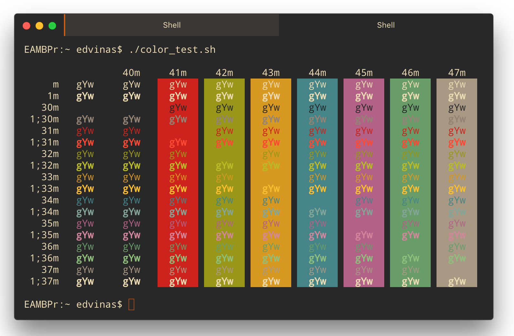
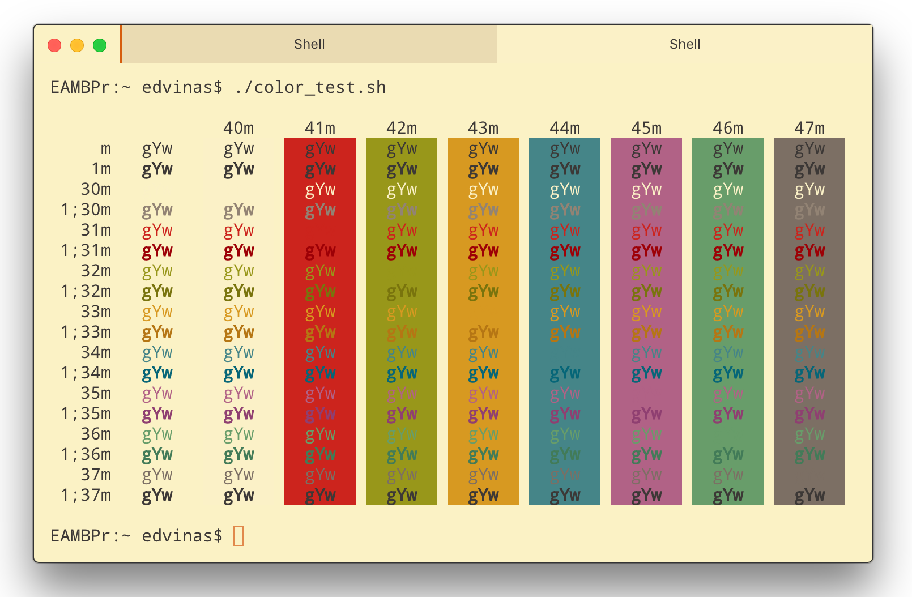

# hyperterm-gruvbox

A [HyperTerm](https://hyperterm.org) theme based on [gruvbox](https://github.com/morhetz/gruvbox).




## Install

Add `hyperterm-gruvbox` to the plugins list in `~/.hyperterm.js` config file.

## Configuration

One can adjust theme `style` and `contrast` options in `~/.hyperterm.js` config file.

```
gruvboxTheme: {
  style: 'dark', // or 'light'
  contrast: 'normal' // or 'soft', 'hard'
},
```

## Inspired by

* [gruvbox](https://github.com/morhetz/gruvbox)
* [hyperterm-gruvbox-dark](https://github.com/mcchrish/hyperterm-gruvbox-dark/)

## License

MIT © Edvinas Aleksejonokas
